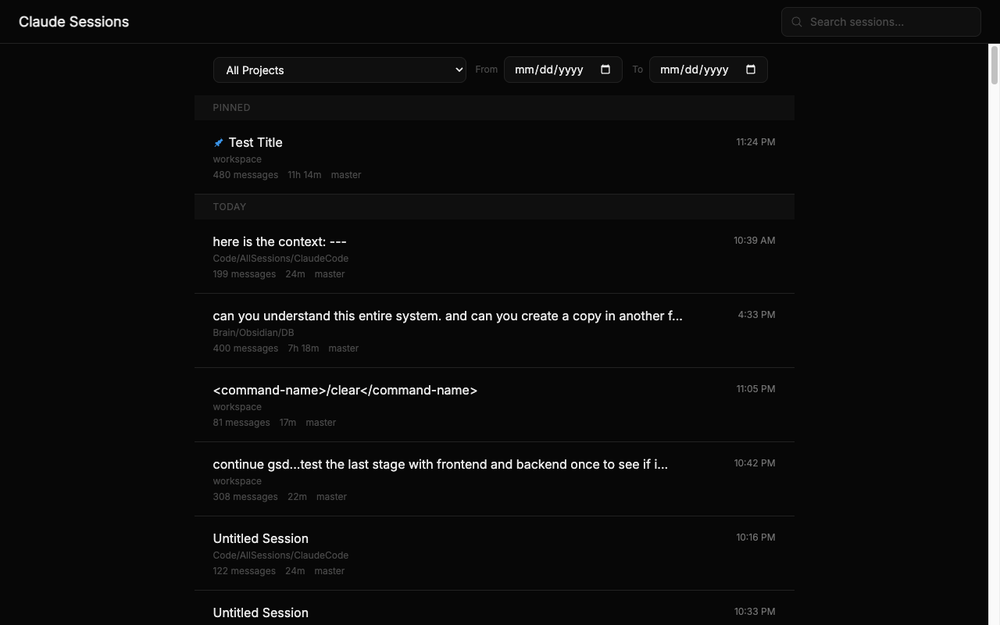
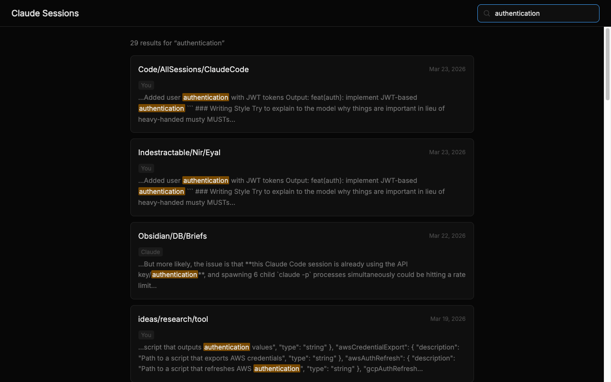

# Claude Session Browser

Browse, search, and organize your past Claude Code sessions in a local web UI.

Claude Code stores every conversation as JSONL files in `~/.claude/projects/`. This tool indexes them into SQLite with full-text search and presents them in a fast, searchable interface.





## Features

- **Full-text search** across all session messages with highlighted snippets
- **Filter by project** to focus on a specific codebase
- **Session detail view** with full conversation history
- **Resume sessions** — open in VS Code terminal or copy the `claude -r` command
- **Organize** — pin sessions, edit titles, add tags
- **Markdown export** of any session
- **Incremental indexing** — only re-parses changed files on startup

## Quick Start

Requires Node.js 18+.

```bash
git clone https://github.com/your-username/claude-session-browser.git
cd claude-session-browser
bash quick-start.sh
```

The script will:
1. Detect your sessions directory (default: `~/.claude/projects`)
2. Let you confirm or provide a custom path
3. Install dependencies
4. Start the app at **http://localhost:5173**

### With Docker

```bash
cp .env.example .env   # optional: customize paths/ports
bash start-dev.sh
```

Or directly:

```bash
docker compose up --build
```

## Configuration

All settings are optional. Set via environment variables or a `.env` file:

| Variable | Default | Description |
|---|---|---|
| `CLAUDE_SESSIONS_PATH` | `~/.claude/projects` | Path to Claude Code session files |
| `PORT` | `5173` | Frontend port |
| `API_PORT` | `3001` | Backend API port |

## Architecture

```
┌─────────────────┐     ┌─────────────────┐
│  React Frontend │────▶│  Express API    │
│  Vite + Tailwind│     │  TypeScript     │
│  :5173          │     │  :3001          │
└─────────────────┘     └────────┬────────┘
                                 │
                        ┌────────▼────────┐
                        │  SQLite + FTS5  │
                        │  sessions.db    │
                        └────────┬────────┘
                                 │
                        ┌────────▼────────┐
                        │  JSONL Files    │
                        │  ~/.claude/     │
                        │  projects/      │
                        └─────────────────┘
```

**Backend** — Node.js/Express (TypeScript). Parses JSONL session files, indexes into SQLite with FTS5 full-text search, exposes REST API.

**Frontend** — React 19, Vite, Tailwind CSS, TanStack Query, React Router.

### API Endpoints

| Method | Path | Description |
|---|---|---|
| `GET` | `/api/sessions` | List sessions (paginated, filterable by project) |
| `GET` | `/api/sessions/:id` | Get session with all messages |
| `PATCH` | `/api/sessions/:id` | Update title, tags, or pin status |
| `GET` | `/api/search?q=` | Full-text search across messages |
| `POST` | `/api/refresh` | Trigger incremental re-index |
| `GET` | `/api/stats` | Session/message counts and project list |

## Development

```bash
# Run backend
npm run dev

# Run frontend (separate terminal)
cd frontend && npm run dev

# Run all tests
npm test && cd frontend && npm test
```

## Session File Format

Claude Code stores sessions as JSONL files at:

```
~/.claude/projects/<dash-encoded-path>/<uuid>.jsonl
```

Each line is a JSON object with `uuid`, `parentUuid`, `type`, and `message` fields. The directory name is the project's absolute path with `/` replaced by `-` (e.g., `-Users-you-Code-myapp`).

## License

ISC
